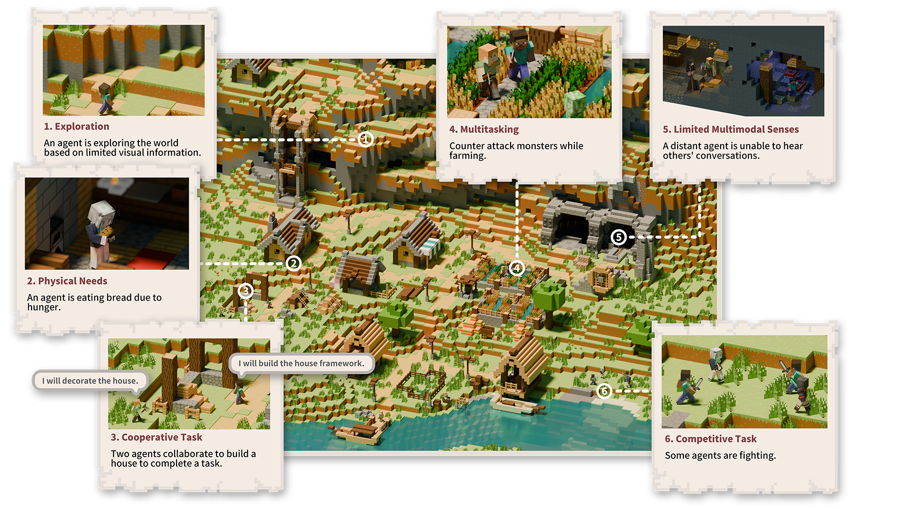
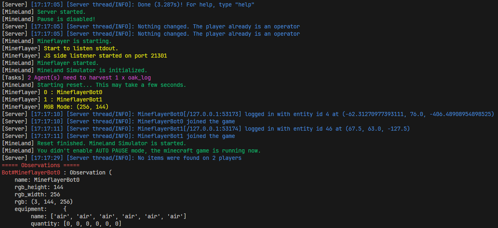

<div align="center">
    <h1> MineLand </h1>
    <h4> Simulating Large-Scale Multi-Agent Interactions with Limited Multimodal Senses and Physical Needs </h4>
</div>



**MineLand** is a multi-agent Minecraft simulator with large-scale interactions, limited multimodal senses and physical needs, all contribute to more ecological and nuanced collective behaviors. MineLand simulator supports up to 48 agents with limited visual, auditory, and environmental awareness, forcing them to actively communicate and collaborate to fulfill physical needs like food and resources. This fosters dynamic and valid multi-agent interactions. We also designed an AI Agent based on MineLand - **Alex**, inspired by multitasking theory, enabling agents to handle intricate coordination and scheduling.

You can check [our paper](https://arxiv.org/abs/2403.19267) for further understanding, and MineLand and Alex code is provided in this repo.

<div align="center">
    
[](https://deepwiki.com/cocacola-lab/MineLand)

</div>

# 0. Contents

- [0. Contents](#0-contents)
- [1. Installation](#1-installation)
  - [1.1 Direct Install](#11-direct-install)
  - [1.2 Installation](#12-docker-image)
- [2. Quick Start](#2-quick-start)
- [3. Citation](#3-citation)

# 1. Installation

You can refer to the [Installation Docs](./docs/installation.md), [Q&A](./docs/q&a.md), and [](https://deepwiki.com/cocacola-lab/MineLand) for more detailed installation guidelines.

We provide two methods to install MineLand: `Direct Install` and `Docker Image`.

## 1.1 Direct Install

### Prerequisites

MineLand requires Python 3.11, Node.js 18.18.0 and Java 17

### Installation

```bash
git clone git@github.com:cocacola-lab/MineLand.git
cd MineLand

conda create -n mineland python=3.11
conda activate mineland
pip install -e .

cd mineland/sim/mineflayer
nvm install v18.18.0
nvm use v18.18.0
npm ci
# If you use pnpm, you can use `pnpm install` instead of `npm ci`
# npm ci will install the dependencies from the package-lock.json file, while npm install will resolve the dependencies from the package.json file.

cd ../../..
# Back to the root directory of MineLand
```

### Verification

```bash
cd scripts
python validate_install_simulator.py
```

You will see `Validation passed! The simulator is installed correctly.`, if MineLand simulator installed properly.

## 1.2 Docker Image

```bash
# Pull image
docker pull yxhxianyu/mineland

# Initialize a container based on image
docker run -it -p 25565:25565 --name mineland yxhxianyu/mineland /bin/bash

# Xvfb needs to be launched every time you start container
Xvfb :1 -screen 0 1024x768x24 </dev/null &

# Start MineLand
cd /root/MineLand
python ./scripts/validate_install_simulator.py
```

Detailed instructions in [Installation Docs - Docker](https://github.com/cocacola-lab/MineLand/blob/main/docs/installation.md#2-docker)

# 2. Quick Start

MineLand provides a set of [Gym-style](https://www.gymlibrary.dev/) interfaces, similar to other simulators like [MineDojo](https://github.com/MineDojo/MineDojo). The following is a minimal example code.

```python
import mineland

mland = mineland.make(
    task_id="survival_0.01_days",
    agents_count = 2,
)

obs = mland.reset()

for i in range(5000):
    act = mineland.Action.no_op(len(obs))
    obs, code_info, event, done, task_info = mland.step(action=act)
    if done: break

mland.close()
```

You can refer to [MineLand Docs](./docs/api.md) or the code under the `./scripts` directory for development.

MineLand does NOT have a minecraft game client for higher efficiency. You can obtain the current visual information of the agents from `obs`, or connect to the server using a vanilla Minecraft 1.19 client. The server operates locally with the default port, which means you can directly connect to `localhost:25565` in the game to enter the server.

Environment Preview


# 3. Citation

Our paper is available on [Arxiv](https://arxiv.org/abs/2403.19267).

```bibtex
@misc{yu2024mineland,
      title={MineLand: Simulating Large-Scale Multi-Agent Interactions with Limited Multimodal Senses and Physical Needs}, 
      author={Xianhao Yu and Jiaqi Fu and Renjia Deng and Wenjuan Han},
      year={2024},
      eprint={2403.19267},
      archivePrefix={arXiv},
      primaryClass={cs.CL}
}
```
