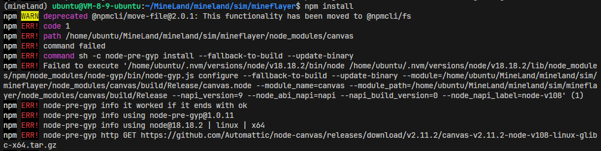
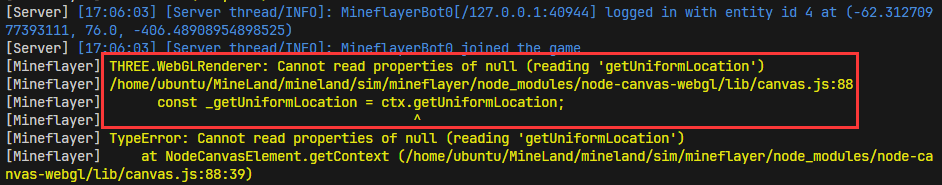
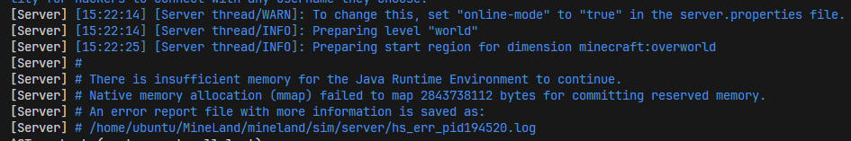

# Installation Documentation

## Content

- [Installation Documentation](#installation-documentation)
  - [Content](#content)
  - [1. Linux (Ubuntu 22.04 LTS)](#1-linux-ubuntu-2204-lts)
    - [1.1 Apt source list](#11-apt-source-list)
    - [1.2 Basic tools](#12-basic-tools)
    - [1.3 Python 3.11 (Anaconda)](#13-python-311-anaconda)
    - [1.4 Node.js 18](#14-nodejs-18)
    - [1.5 Java 17](#15-java-17)
    - [1.6 MineLand](#16-mineland)
    - [1.7 Validate](#17-validate)
    - [1.8 Headless machine](#18-Headless-machine)
  - [2. Docker](#2-docker)
  - [3. Q\&A](#3-qa)

## 1. Linux (Ubuntu 22.04 LTS)

We will install MineLand step by step, in the new Ubuntu 22.04 LTS of Tencent Cloud Server.

MineLand requires at least **4G of memory** and **non-headless** (headed) machine.

If you are using a headless machine, you can refer to [1.8 Headless machine](#18-Headless-machine).

### 1.1 Apt source list

The apt sources list is as follows. You can check the following sources **if apt unable to locate some packages**.

```
deb http://mirrors.tencentyun.com/ubuntu jammy main restricted

deb http://mirrors.tencentyun.com/ubuntu jammy-updates main restricted

deb http://mirrors.tencentyun.com/ubuntu jammy universe
deb http://mirrors.tencentyun.com/ubuntu jammy-updates universe

deb http://mirrors.tencentyun.com/ubuntu jammy multiverse
deb http://mirrors.tencentyun.com/ubuntu jammy-updates multiverse

deb http://mirrors.tencentyun.com/ubuntu jammy-security main restricted
deb http://mirrors.tencentyun.com/ubuntu jammy-security universe
deb http://mirrors.tencentyun.com/ubuntu jammy-security multiverse
```

### 1.2 Basic tools

```bash
sudo apt update
sudo apt upgrade
sudo apt install -y build-essential git wget curl
sudo apt-get install -y libcairo2-dev libpango1.0-dev libjpeg-dev libgif-dev librsvg2-dev # For node-canvas in node.js
sudo apt-get install -y libxi-dev libglu1-mesa-dev libglew-dev pkg-config # For headless-gl in node.js
```

**Be careful**,  you need to [choose suitable packages for node-canvas](https://github.com/Automattic/node-canvas?tab=readme-ov-file#compiling) according to your OS.

### 1.3 Python 3.11 (Anaconda)

We will install [Anaconda](https://www.anaconda.com/) to use python.

You can check [Installing on Linux](https://docs.anaconda.com/free/anaconda/install/linux/) for detailed infomation and skip this subsection.

Be careful, you need to **change Anaconda version**, if you don't use Linux-x86_64.

```bash
curl -O https://repo.anaconda.com/archive/Anaconda3-2024.02-1-Linux-x86_64.sh
bash ./Anaconda3-2024.02-1-Linux-x86_64.sh
# The following is an example to install anaconda according to the guideness.
<Enter>
<q>
yes<Enter>
<Enter>
yes<Enter> # This step is important.
<Re-start your shell>
# After re-start your shell, you should see a '(base)' before your shell prompt.
```

Validate Anaconda installation by executing `conda --version` and the output may be `conda 24.1.2`.

```bash
conda create -n mineland python=3.11
<Enter>
conda activate mineland
```

Validate python installation by executing `python --version` and the output may be `Python 3.11.8`

### 1.4 Node.js 18

We will install [NVM - Node Version Manager](https://github.com/nvm-sh/nvm) to use node.js.

```bash
curl -o- https://raw.githubusercontent.com/nvm-sh/nvm/v0.39.7/install.sh | bash
<Re-start your shell>
```

Validate NVM installation by executing `nvm --version` and the output may be `0.39.7`.

```bash
nvm install v18.18.2
nvm use v18.18.2
# You can set a default version for node.js by executing:
nvm alias default v18.18.2
```

Validate NVM installation by executing `node --version` and the output may be `v18.18.2`.

### 1.5 Java 17

If you have any other versions, you can use `sudo update-alternatives java` to switch java version.

```bash
sudo apt install openjdk-17-jdk
```

Validate java installation by executing `java -version` and the output may be `openjdk version "17.0.10" 2024-01-16`.

### 1.6 MineLand

```bash
git clone https://github.com/cocacola-lab/MineLand.git
cd MineLand

# Make sure you have activated `mineland` virtual environment,
#   before executing the following command.
pip install -e .

cd mineland/sim/mineflayer
npm ci
# ci means installing according to package-lock.json
# There are lots of dependencies in node.js, which require some time to install...
```

### 1.7 Validate

```bash
# move back to MineLand root directory
cd ../../../
python ./scripts/validate_install_simulator.py
```

> Congratulations!

### 1.8 Headless machine

```bash
sudo apt install -y xvfb
Xvfb :1 -screen 0 1024x768x24 </dev/null &
export DISPLAY=":1"
```

## 2. Docker

* TODO

## 3. Q&A

* Why `npm ci` reports `npm ERR! command sh -c node-pre-gyp install --fallback-to-build...`

  * 
  
  * **Answer**
    * The dependencies of node-canvas may be forgotten to install, please refer to [This docs](https://github.com/Automattic/node-canvas?tab=readme-ov-file#compiling)

* Why `npm ci` reports `ETIMEOUT 20.205.243.166:443`

  * 
  
  * **Answer**
    * The reasons caused by the network. You can retry or use VPN.

* Why Mineflayer reports `THREE.WebGLRenderer: Cannot read properties of null...`

  * 
  * **Answer**
    * You probably run MineLand **in a headless machine**.
    * Refer to [This guide](https://github.com/stackgl/headless-gl?tab=readme-ov-file#how-can-headless-gl-be-used-on-a-headless-linux-machine), you needs to install [Xvfb](https://en.wikipedia.org/wiki/Xvfb) and [Mesa](https://docs.mesa3d.org/).
    * A simple method to fix is [1.8 Headless machine](#18-Headless-machine).

* Why MineLand reports `RuntimeWarning: Couldn't find ffmpeg or avconv...`

  * 
  * **Answer**
    * MineLand provides Audio Information in observation space.
    * If you want to enable **Sound System** and let agents to deal with sounds, **ffmpeg** needs to be installed. Then, add `enable_sound_system = True` in mineland.make()
    * Or, you can ignore this info.

* Why server reports `Netty Server IO ERROR, Thread dumps`

  * 
  * In fact, the cause of this problem is unknown. This may be related to personal computer configuration.
  * **Answer**
    * Restart MineLand to try again.

* Why server reports `There is insufficient memory for the JRE to continue.`

  * 
  * **Answer**
    * You need to upgrade your machine or 

* Why mineflayer reports `Type Error: Cannot read properties of undefined (reading 'yaw')

  * 

  * **Answer**

    * The bot has not been fully initialized yet.

    * You can increase the initialization duration in `app.post("/start"...)` of `./mineland/sim/mineflayer/index.js`.

    * ```javascript
      setTimeout(() => {
          obs = []
          for(let i = 0; i < number_of_bot; i++) {
              obs.push(bot_manager.getBotObservation(i));
          }
          res.status(200).json({
              return_code: 200,
              observation: obs,
          })
      }, 20000) // wait for 20 seconds to make sure all bots are spawned
      // You can change 20000 to 30000 to avoid this problem
      ```