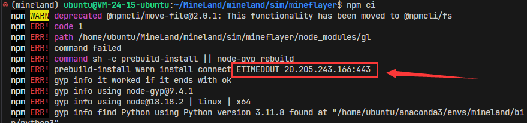
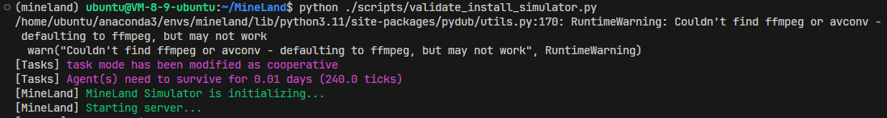
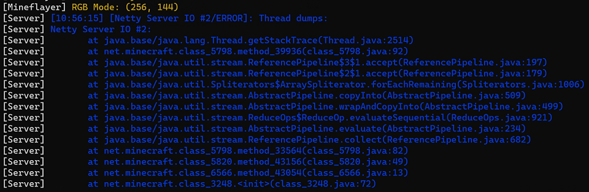
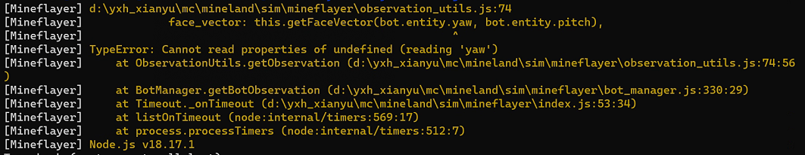

# Q&A

* Why `npm ci` reports `npm ERR! command sh -c node-pre-gyp install --fallback-to-build...`

  * 
  
  * **Answer**
    * The dependencies of node-canvas may be forgotten to install, please refer to [This docs](https://github.com/Automattic/node-canvas?tab=readme-ov-file#compiling)

* Why `npm ci` reports `ETIMEOUT 20.205.243.166:443`

  * 
  
  * **Answer**
    * The reasons caused by the network. You can retry or use VPN.

* Why Mineflayer reports `THREE.WebGLRenderer: Cannot read properties of null...`

  * 
  * **Answer**
    * You probably run MineLand **in a headless machine**.
    * Refer to [This guide](https://github.com/stackgl/headless-gl?tab=readme-ov-file#how-can-headless-gl-be-used-on-a-headless-linux-machine), you needs to install [Xvfb](https://en.wikipedia.org/wiki/Xvfb) and [Mesa](https://docs.mesa3d.org/).
    * A simple method to fix is [1.8 Headless machine](#18-Headless-machine).

* Why MineLand reports `RuntimeWarning: Couldn't find ffmpeg or avconv...`

  * 
  * **Answer**
    * MineLand provides Audio Information in observation space.
    * If you want to enable **Sound System** and let agents to deal with sounds, **ffmpeg** needs to be installed. Then, add `enable_sound_system = True` in mineland.make()
    * Or, you can ignore this info.

* Why server reports `Netty Server IO ERROR, Thread dumps`

  * 
  * In fact, the cause of this problem is unknown. This may be related to personal computer configuration.
  * **Answer**
    * Restart MineLand to try again.

* Why server reports `There is insufficient memory for the JRE to continue.`

  * 
  * **Answer**
    * You need to upgrade your machine or 

* Why mineflayer reports `Type Error: Cannot read properties of undefined (reading 'yaw')

  * 

  * **Answer**

    * The bot has not been fully initialized yet.

    * You can increase the initialization duration in `app.post("/start"...)` of `./mineland/sim/mineflayer/index.js`.

    * ```javascript
      setTimeout(() => {
          obs = []
          for(let i = 0; i < number_of_bot; i++) {
              obs.push(bot_manager.getBotObservation(i));
          }
          res.status(200).json({
              return_code: 200,
              observation: obs,
          })
      }, 20000) // wait for 20 seconds to make sure all bots are spawned
      // You can change 20000 to 30000 to avoid this problem
      ```